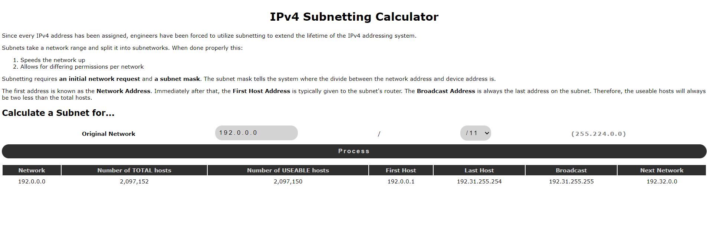

# Algorithm Practise: Subnetting (IPv4)

__Live Version__ An interactive webpage can be found [here](https://de-mark.github.io/algorithms_subnetting/)

## What is Subnetting?

Since every IPv4 address has been assigned, engineers have been forced to utilize subnetting to extend the lifetime of the IPv4 addressing system.

Subnets take a network range and split it into subnetworks. When done properly this:

- Speeds the network up
- Allows for differing permissions per network

Subnetting requires an **initial network address** and **a subnet mask**. The subnet mask tells the system where the divide between the network address and device address is.

The first address is known as the **Network Address**. Immediately after that, the **First Host Address** is typically given to the subnet's router. The **Broadcast Address** is always the last address on the subnet. Therefore, the useable hosts will always be two less than the total hosts.

## Example Subnet Breakdown

### IPv4 : 192.0.0.0 /24

<table>
            <thead>
                <tr>
                    <th>
                        Network
                    </th>
                    <th>
                        Number of TOTAL hosts
                    </th>
                    <th>
                        Number of USEABLE hosts
                    </th>
                    <th>
                        First Host
                    </th>
                    <th>
                        Last Host
                    </th>
                    <th>
                        Broadcast
                    </th>
                    <th>
                        Next Network
                    </th>
                </tr>
            </thead>
            <tbody>
                <tr>
                    <td id="cell_network">
                        192.0.0.0
                    </td>
                    <td id="cell_totalhosts">
                        256
                    </td>
                    <td id="cell_numhosts">
                        254
                    </td>
                    <td id="cell_firsthost">
                        192.0.0.1
                    </td>
                    <td id="cell_lasthost">
                        192.0.0.254
                    </td>
                    <td id="cell_broadcast">
                        192.0.0.255
                    </td>
                    <td id="cell_nextnet">
                        192.0.1.0
                    </td>
                </tr>
            </tbody>
        </table>

## Why Program it?

Everyone has told me that understanding subnetting is crucial for the Network+ exam, so I wanted to program a subnet calculator to better solidify my understanding!

## How this program works:

Since the algorithm is simple enough (translation into and out of binary), the program is written in JavaScript and hooked up to a webpage (located [here](https://de-mark.github.io/algorithms_subnetting/)).

Once the user provides a base network and subnet, the program will calculate the subnet and fill out the corresponding fields.